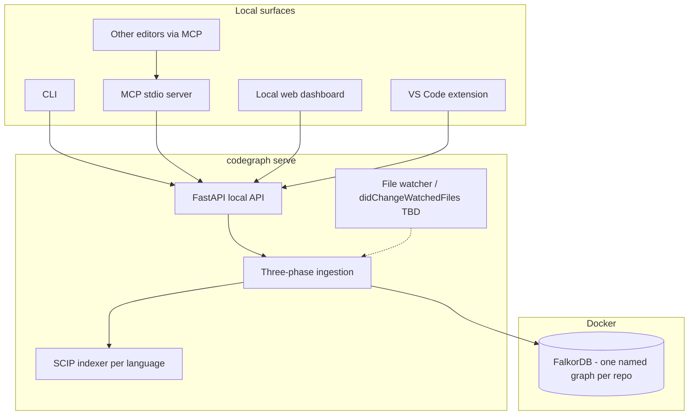
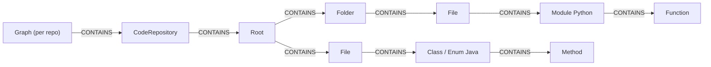

# CodeGraph

> **Desktop codegraph builder.** Ingest local repositories — **one FalkorDB named graph per repository** — persist everything in **[FalkorDB](https://www.falkordb.com)** (Docker), and expose the same capability through a **CLI**, **local HTTP API**, **MCP**, **VS Code extension**, and **other editors via MCP**.

CodeGraph constructs a hierarchical knowledge graph: each repository is its own named graph, where a **Graph** node connects 1:1 to a **CodeRepository** node; the repo has a filesystem **Root**, **Folder** / **File** nodes, and each ingested source **File** links to **top-level code symbols** (e.g. `:Module` for Python, `:Class` / `:Enum` for Java). Phase 2 enriches the graph with semantic labels and edges using **SCIP** (definition labels + relationships) and **regex** (modifier/intent labels). There is no LSP and no tier system.

The app assumes a **trusted single-user machine** bound to localhost; there is no multi-user authentication layer.

**Embedding / semantic retrieval:** **TBD** — provider and storage strategy will be chosen after locking requirements (see [Query flow (TBD)](#query-flow-tbd)).

**Language indexing:** Design targets SCIP indexers (`scip-java`, `scip-python`, `scip-typescript`, `scip-clang`, …) per language. Phase 2 derives all relationships from the SCIP index; no LSP servers are used in ingestion.

---

## Table of Contents

- [Features](#features)
- [System architecture](#system-architecture)
- [Structural graph schema](#structural-graph-schema)
- [Three-phase ingestion](#three-phase-ingestion)
- [Tech stack](#tech-stack)
- [Surfaces](#surfaces)
- [Graphs & repos](#graphs--repos)
- [Getting started](#getting-started-local-desktop)
- [Environment variables](#environment-variables)
- [Documentation map](#documentation-map)
- [Incremental graph updates (TBD)](#incremental-graph-updates-tbd)
- [Query flow (TBD)](#query-flow-tbd)
- [Contributing](#contributing)

---

## Features

- **Local-first** — one FalkorDB container; isolation via **one named graph per repository** inside that instance.
- **One graph per repo** — each repository is its own independent named graph (a `Graph` node 1:1 with a `CodeRepository`).
- **Absolute paths only for ingestion** — you register the exact directory on disk (`CodeRepository.local_path`).
- **Three-phase indexing** — Phase 0: filesystem scan, file classification, content hashing, structural graph write; Phase 1: SCIP-derived code-symbol nodes and `CONTAINS`; Phase 2: SCIP (definition labels + relationships) and regex (modifier/intent labels), no tiers and no LSP; see [PHASE0_IMPLEMENTATION.md](PHASE0_IMPLEMENTATION.md), [PHASE1_IMPLEMENTATION.md](PHASE1_IMPLEMENTATION.md), [PHASE2_IMPLEMENTATION.md](PHASE2_IMPLEMENTATION.md).
- **Editors** — VS Code extension for dashboard-style actions + jump-to-source; any MCP-capable editor (Cursor, Claude Desktop, JetBrains, Zed, Neovim MCP clients, …) talks to the **same local API** via the MCP shim.
- **Local web dashboard** — optional UI served alongside the API (ingestion progress, graphs, repos, future query UI).

---

## System architecture



### Indexing overview

1. **Register** a repository — this creates its own named graph (a `Graph` node 1:1 with the `CodeRepository`) with **`local_path`**.
2. **Phase 0** walks the filesystem, classifies every file by extension, hashes file content (SHA-256), and writes the complete structural skeleton — `:Root → (:Folder|:File)` — to FalkorDB in a single batch. `content_hash` on each `:File` node is used by the update pipeline to detect modifications.
3. **Phase 1** takes the `SourceFile` entries from Phase 0 and runs **SCIP** to populate code-symbol nodes under each `:File` with `CONTAINS` chains down to nested symbols.
4. **Phase 2** adds semantics from two sources, no tiers and no LSP: **SCIP** (definition labels, `Object`, `InnerClass`, `External`; relationships `INHERITS`/`IMPLEMENTS`/`CALLS`/`SETS`/`GETS`/`OVERRIDES`/`BELONGS_TO`) and **regex** (modifier/intent labels + scalar properties). `INSTANTIATES` is removed; `SPAWNS` is deferred.
5. Queries (when designed) execute **only within that repository's FalkorDB named graph**.

---

## Structural graph schema

A single **`CONTAINS`** relationship type spans containment at every structural level:

`(:Graph)` → `(:CodeRepository)` → `(:Root)` → `(:Folder|:File)` → **top-level code** (e.g. `:Module`, `:Class`, `:Enum`) → inner symbols (`:Method`, `:Function`, …).



- Queries and writes are scoped by **FalkorDB named graph** (one per repository, 1:1 with `Graph`/`CodeRepository`).
- Repo history and versioning beyond the graph itself are **out of scope** for this design.

---

## Three-phase ingestion

- **Phase 0** — Structural skeleton: walk the filesystem, classify every file by extension, compute a SHA-256 `content_hash` for each file, write all `Root / Folder / File` nodes and `CONTAINS` edges to FalkorDB in a single batch. See [PHASE0_IMPLEMENTATION.md](PHASE0_IMPLEMENTATION.md).
- **Phase 1** — SCIP extraction: for each `SourceFile` node produced by Phase 0, run the language-specific SCIP indexer, parse `index.scip`, emit code-symbol nodes + `CONTAINS` edges, batch-write to FalkorDB. See [PHASE1_IMPLEMENTATION.md](PHASE1_IMPLEMENTATION.md).
- **Phase 2** — Two mechanisms, no tiers and no LSP: **SCIP** for definition labels + `Object`/`InnerClass`/`External` + relationships (`INHERITS`/`IMPLEMENTS`/`CALLS`/`SETS`/`GETS`/`OVERRIDES`/`BELONGS_TO`), and **regex** for modifier/intent labels + scalar properties. `INSTANTIATES` removed; `SPAWNS` deferred. See [PHASE2_IMPLEMENTATION.md](PHASE2_IMPLEMENTATION.md).

---

## Tech stack

| Layer | Technology |
|------|-------------|
| Local API | Python 3.12+, FastAPI, Uvicorn |
| CLI | Typer / Click (`codegraph`) |
| Graph DB | FalkorDB in Docker (**one instance**, **one named graph per repository**) |
| Indexing Phase 1 (symbols) | SCIP toolchain per language (`scip-java`, …) |
| Indexing Phase 2 (labels + edges) | SCIP index (relationships + occurrences) + per-language regex; no LSP |
| MCP | Python MCP SDK (stdio server calling local REST) |
| Web dashboard | React 18 + TypeScript + Vite (served on localhost with the daemon) |
| VS Code extension | TypeScript VS Code Extension API |
| Orchestration docs | PHASE0 / PHASE1 / PHASE2, [DESKTOP_ARCHITECTURE.md](DESKTOP_ARCHITECTURE.md), [Backend_API.md](Backend_API.md) |

---

## Surfaces

| Surface | Purpose |
|---------|---------|
| **CLI** | `codegraph graphs`, repos, ingest, serve, MCP proxy |
| **REST** (`http://localhost:8765`) | Graph CRUD, repo attach, ingestion SSE/status — see [Backend_API.md](Backend_API.md) |
| **MCP** | Tools map 1:1 to REST for agents |
| **VS Code / editors** | Native extension or MCP → same endpoints |

Detailed mapping lives in [DESKTOP_ARCHITECTURE.md](DESKTOP_ARCHITECTURE.md).

---

## Graphs & repos

- **`Graph`** (FalkorDB graph name): one per repository; isolation is **by separate named graph**.
- **`CodeRepository`**: binds a **friendly `name`** to an **`local_path`** (absolute filesystem path); exactly one per graph (1:1 with `Graph`).
- Each repository lives in its own named graph, so queries need no `repo_name`/`path` cross-repo filtering.
- Ingest jobs are **scoped** to a single `(graph_name == repo)`.

---

## Getting started (local desktop)

Only FalkorDB runs in a container. The backend API (which also serves the web
dashboard) and the ingestion worker run **natively on the host**.

### Prerequisites

- Docker Desktop (or compatible runtime) — for FalkorDB only
- Python 3.12+
- Installed SCIP indexer(s) per language on your PATH — e.g. `scip-python`, `scip-java` (exact packages per language rollout)

### 1. Start FalkorDB (the only container)

```bash
cp .env.example .env      # set FALKOR_BROWSER_ENCRYPTION_KEY (openssl rand -hex 32)
docker compose up -d      # only the falkordb service is defined
```

This exposes FalkorDB on `127.0.0.1:6379` and the FalkorDB Browser on `127.0.0.1:3000`.

### 2. Run the backend natively

```bash
cd services/api
pip install -r requirements.txt
uvicorn app.main:app --host 127.0.0.1 --port 8765
```

The API listens on `http://127.0.0.1:8765` and serves the web dashboard at `/`.
It connects to the FalkorDB container on `127.0.0.1:6379` (override via
`FALKOR_HOST` / `FALKOR_PORT`). Because the backend runs on the host, repository
`local_path` values are real paths on this machine — no bind-mount translation.

### 3. Create a graph & attach a repo

Use the CLI or REST:

```bash
curl -s -X POST http://127.0.0.1:8765/api/v1/graphs \
  -H "Content-Type: application/json" \
  -d '{"name": "work"}'

curl -s -X POST http://127.0.0.1:8765/api/v1/graphs/work/repositories \
  -H "Content-Type: application/json" \
  -d '{"name": "api", "local_path": "/abs/path/to/your/repo"}'

curl -N -X POST http://127.0.0.1:8765/api/v1/graphs/work/repositories/api/ingest \
  -H "Content-Type: application/json" \
  -d '{"local_path": "/abs/path/to/your/repo"}'
```

Paths must exist on disk; re-ingestion replaces **that repo’s subgraph** (exact delete strategy TBD in incremental design).

---

## Environment variables

| Variable | Required | Description |
|---------|----------|-------------|
| `FALKORDB_URL` | Yes* | Redis/FalkorDB URI, default `redis://127.0.0.1:6379` |
| `CODEGRAPH_HOME` | No | Defaults to `~/.codegraph` (config, logs) |
| `CODEGRAPH_API_BIND` | No | Default `127.0.0.1:8765` |
| `SCIP_JAVA_BIN` / `SCIP_PYTHON_BIN` / … | No | Override SCIP indexer paths |
| `OPENAI_API_KEY` | TBD | Only if embeddings/LLM path retained |

\* Required once implementation reads config from env files.

See [DEPLOYMENT_CHECKLIST.md](DEPLOYMENT_CHECKLIST.md) for a fuller install checklist.

---

## Documentation map

| Doc | Contents |
|-----|----------|
| [DESKTOP_ARCHITECTURE.md](DESKTOP_ARCHITECTURE.md) | Process model, CLI/MCP/route mapping |
| [Backend_API.md](Backend_API.md) | REST surface (localhost) |
| [PHASE0_IMPLEMENTATION.md](PHASE0_IMPLEMENTATION.md) | Phase 0: filesystem scan, classification, content hashing, structural graph write |
| [PHASE1_IMPLEMENTATION.md](PHASE1_IMPLEMENTATION.md) | Phase 1: SCIP extraction + code-symbol graph write |
| [PHASE2_IMPLEMENTATION.md](PHASE2_IMPLEMENTATION.md) | Phase 2 SCIP + regex labels/edges on FalkorDB |
| [core_system/Retrival_system_README.md](core_system/Retrival_system_README.md) | Retrieval notes + **Query TBD** |
| [core_system/documentation/Nodes.txt](core_system/documentation/Nodes.txt) | Label reference |
| [core_system/documentation/Relationships.txt](core_system/documentation/Relationships.txt) | Edge reference |
| [falkor/README.md](falkor/README.md) | FalkorDB ops & index guidance |
| [repository_structure.md](repository_structure.md) | Monorepo layout (desktop) |

---

## Incremental graph updates (TBD)

**Intent (not finalized):** combine OS-level file-change notifications → compute dirty file set → re-run SCIP for the affected repo graph → **`DELETE`/replace by `path`/symbol IDs** followed by constrained Phase 2 passes (SCIP labels + regex + SCIP relationships) on touched nodes → optional full-repo consistency pass for cross-file CALLS/OVERRIDES.

Document the chosen algorithm inside `DESKTOP_ARCHITECTURE.md` + worker docs once prototyping finishes.

---

## Query flow (TBD)

Natural-language retrieval, embedding models, MCP execution paths, and result shaping are **intentionally unspecified** pending:

1. Embedding strategy (hosted vs local model vs graph-only baseline).
2. Whether LLM-authored Cypher remains the orchestration mechanism on FalkorDB.
3. How snippets load from disk using `repo` + `path` + line ranges.

Reserve `POST /api/v1/graphs/{name}/query` until this design closes — see [Backend_API.md](Backend_API.md).

---

## Contributing

1. Fork the repository and branch from `main`.
2. Keep documentation synced when changing ingestion or retrieval behavior.
3. Desktop packaging (PyInstaller/etc.) discussed separately.
