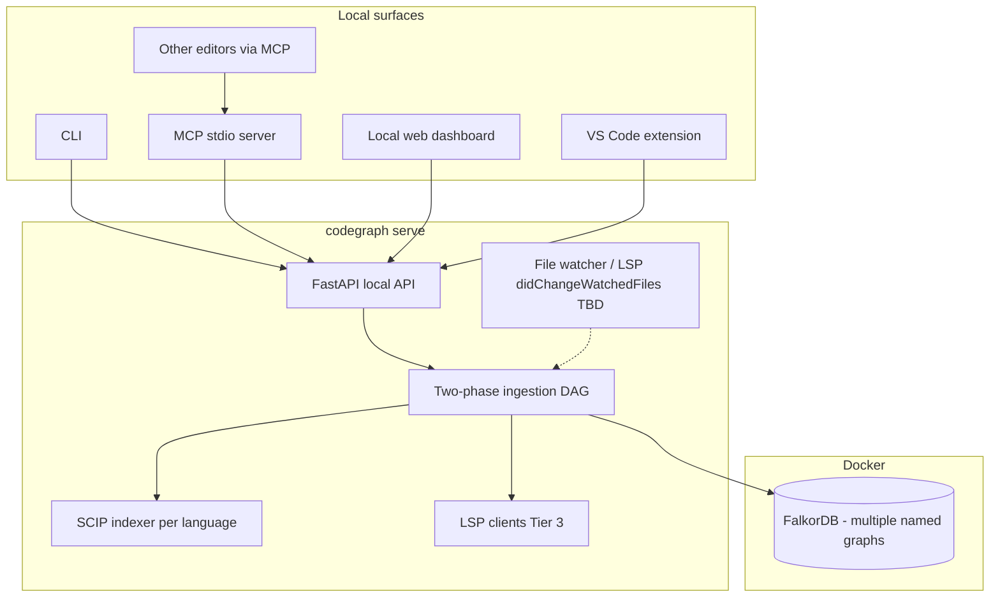
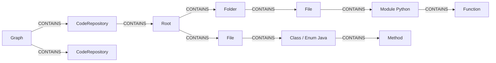

# CodeGraph

> **Desktop codegraph builder.** Ingest multiple local repositories into independent graph workspaces, persist everything in **[FalkorDB](https://www.falkordb.com)** (Docker), and expose the same capability through a **CLI**, **local HTTP API**, **MCP**, **VS Code extension**, and **other editors via MCP**.

CodeGraph constructs a hierarchical knowledge graph: each **workspace Graph** connects to **CodeRepository** nodes; each repo has a filesystem **Root**, **Folder** / **File** nodes, and each ingested source **File** links to **top-level code symbols** (e.g. `:Module` for Python, `:Class` / `:Enum` for Java). Phase 2 enriches the graph with semantic labels and edges using a tiered DAG: **SCIP** for Tier 1 structure and **LSP** for complex live edges.

The app assumes a **trusted single-user machine** bound to localhost; there is no multi-user authentication layer.

**Embedding / semantic retrieval:** **TBD** — provider and storage strategy will be chosen after locking requirements (see [Query flow (TBD)](#query-flow-tbd)).

**Language indexing:** Design targets SCIP indexers (`scip-java`, `scip-python`, `scip-typescript`, `scip-clang`, …) plus LSP tier-3 adapters per language.

---

## Table of Contents

- [Features](#features)
- [System architecture](#system-architecture)
- [Structural graph schema](#structural-graph-schema)
- [Two-phase ingestion (DAG)](#two-phase-ingestion-dag)
- [Tech stack](#tech-stack)
- [Surfaces](#surfaces)
- [Graph workspaces & repos](#graph-workspaces--repos)
- [Getting started](#getting-started-local-desktop)
- [Environment variables](#environment-variables)
- [Documentation map](#documentation-map)
- [Incremental graph updates (TBD)](#incremental-graph-updates-tbd)
- [Query flow (TBD)](#query-flow-tbd)
- [Contributing](#contributing)

---

## Features

- **Local-first** — one FalkorDB container; workspace isolation via **named graphs** inside that instance.
- **Multiple graphs** — create several independent workspaces; each can attach **many** local repository roots (`CodeRepository`).
- **Absolute paths only for ingestion** — you register the exact directory on disk (`CodeRepository.local_path`).
- **Two-phase indexing** — Phase 1: structural skeleton + SCIP-derived nodes and `CONTAINS`; Phase 2: tiers (SCIP+kinds+regex → LSP-heavy edges → graph-dependent DAG steps); see [PHASE1_IMPLEMENTATION.md](PHASE1_IMPLEMENTATION.md), [PHASE2_IMPLEMENTATION.md](PHASE2_IMPLEMENTATION.md).
- **Editors** — VS Code extension for dashboard-style actions + jump-to-source; any MCP-capable editor (Cursor, Claude Desktop, JetBrains, Zed, Neovim MCP clients, …) talks to the **same local API** via the MCP shim.
- **Local web dashboard** — optional UI served alongside the API (ingestion progress, graphs, repos, future query UI).

---

## System architecture



### Indexing overview

1. **Register** a graph workspace and attach one or more `CodeRepository` records with **`local_path`**.
2. **Phase 1** builds `:Graph → :CodeRepository → :Root → (:Folder|:File)` and, for analyzable sources, runs **SCIP** to populate code nodes under each `:File` with `CONTAINS` chains down to nested symbols.
3. **Phase 2** runs the tier DAG: Tier 1 (SCIP `SymbolKind` + relationships + regex), Tier 3 (LSP call/hover/definition/highlight), Tier 2 (sequential InnerClass / OVERRIDES / External / SPAWNS, …).
4. Queries (when designed) execute **only within the selected FalkorDB named graph**.

---

## Structural graph schema

A single **`CONTAINS`** relationship type spans containment at every structural level:

`(:Graph)` → `(:CodeRepository)` → `(:Root)` → `(:Folder|:File)` → **top-level code** (e.g. `:Module`, `:Class`, `:Enum`) → inner symbols (`:Method`, `:Function`, …).



- Queries and writes are scoped by **FalkorDB named graph** (one per workspace `Graph`).
- Workspace history and versioning beyond the graph itself are **out of scope** for this design.

---

## Two-phase ingestion (DAG)

- **Phase 1** — Structural + SCIP: create graph skeleton, classify files by extension (`File`, `Dockerfile`, …), ingest whole-file tertiary nodes without SCIP/LSP embedding, emit SCIP-derived code nodes + `CONTAINS`, batch-write to FalkorDB.
- **Phase 2** — Same Tier 1 → Tier 3 → Tier 2 DAG as documented in [PHASE2_IMPLEMENTATION.md](PHASE2_IMPLEMENTATION.md), with Tier 1 driven primarily by SCIP payloads and Tier 3 by LSP.

---

## Tech stack

| Layer | Technology |
|------|-------------|
| Local API | Python 3.12+, FastAPI, Uvicorn |
| CLI | Typer / Click (`codegraph`) |
| Graph DB | FalkorDB in Docker (**one instance**, multiple **named graphs**) |
| Indexing Phase 1 (symbols) | SCIP toolchain per language (`scip-java`, …) |
| Indexing Phase 2 Tier 3 | LSP servers (jdtls, pyright/clangd/tsserver, …) |
| MCP | Python MCP SDK (stdio server calling local REST) |
| Web dashboard | React 18 + TypeScript + Vite (served on localhost with the daemon) |
| VS Code extension | TypeScript VS Code Extension API |
| Orchestration docs | PHASE1 / PHASE2, [DESKTOP_ARCHITECTURE.md](DESKTOP_ARCHITECTURE.md), [Backend_API.md](Backend_API.md) |

---

## Surfaces

| Surface | Purpose |
|---------|---------|
| **CLI** | `codegraph graphs`, repos, ingest, serve, MCP proxy |
| **REST** (`http://localhost:8765`) | Graph CRUD, repo attach, ingestion SSE/status — see [Backend_API.md](Backend_API.md) |
| **MCP** | Tools map 1:1 to REST for agents |
| **VS Code / editors** | Native extension or MCP → same endpoints |

Detailed mapping lives in [DESKTOP_ARCHITECTURE.md](DESKTOP_ARCHITECTURE.md).

---

## Graph workspaces & repos

- **`Graph`** (FalkorDB graph name): logical workspace; isolation is **by separate named graph**.
- **`CodeRepository`**: binds a **friendly `name`** to an **`local_path`** (absolute filesystem path).
- Multiple repos inside one Graph share one query namespace (queries must filter by `repo`/`path` deliberately).
- Ingest jobs are **scoped** `(graph_name, repo_name)`.

---

## Getting started (local desktop)

### Prerequisites

- Docker Desktop (or compatible runtime)
- Python 3.12+ if running services outside Docker images
- Installed SCIP indexer(s) + LSP server(s) per language on your PATH (exact packages TBD per language rollout)

### 1. Start FalkorDB

```bash
docker compose up -d falkordb
```

(When `docker-compose.yml` includes FalkorDB; until then see [falkor/README.md](falkor/README.md) for `docker run` equivalents.)

### 2. Install the CLI & run the daemon

```bash
pipx install codegraph   # illustrative; package name subject to packaging
codegraph init           # seeds ~/.codegraph/
codegraph serve          # listens on http://127.0.0.1:8765 (+ static dashboard assets)
```

### 3. Create a workspace & attach repos

Use the CLI or REST:

```bash
curl -s -X POST http://127.0.0.1:8765/api/v1/graphs \
  -H "Content-Type: application/json" \
  -d '{"name": "work"}'

curl -s -X POST http://127.0.0.1:8765/api/v1/graphs/work/repositories \
  -H "Content-Type: application/json" \
  -d '{"name": "api", "local_path": "/abs/path/to/your/repo"}'

curl -N -X POST http://127.0.0.1:8765/api/v1/graphs/work/repositories/api/ingest \
  -H "Content-Type: application/json" \
  -d '{"local_path": "/abs/path/to/your/repo"}'
```

Paths must exist on disk; re-ingestion replaces **that repo’s subgraph** (exact delete strategy TBD in incremental design).

---

## Environment variables

| Variable | Required | Description |
|---------|----------|-------------|
| `FALKORDB_URL` | Yes* | Redis/FalkorDB URI, default `redis://127.0.0.1:6379` |
| `CODEGRAPH_HOME` | No | Defaults to `~/.codegraph` (config, logs) |
| `CODEGRAPH_API_BIND` | No | Default `127.0.0.1:8765` |
| `SCIP_JAVA_BIN` / `SCIP_PYTHON_BIN` / … | No | Override SCIP indexer paths |
| `JDTLS_HOME`, `JAVA_HOME`, … | No | LSP launcher paths (per language) |
| `OPENAI_API_KEY` | TBD | Only if embeddings/LLM path retained |

\* Required once implementation reads config from env files.

See [DEPLOYMENT_CHECKLIST.md](DEPLOYMENT_CHECKLIST.md) for a fuller install checklist.

---

## Documentation map

| Doc | Contents |
|-----|----------|
| [DESKTOP_ARCHITECTURE.md](DESKTOP_ARCHITECTURE.md) | Process model, CLI/MCP/route mapping |
| [Backend_API.md](Backend_API.md) | REST surface (localhost) |
| [PHASE1_IMPLEMENTATION.md](PHASE1_IMPLEMENTATION.md) | Phase 1 + Falkor indexes |
| [PHASE2_IMPLEMENTATION.md](PHASE2_IMPLEMENTATION.md) | Tier DAG on FalkorDB |
| [core_system/Retrival_system_README.md](core_system/Retrival_system_README.md) | Retrieval notes + **Query TBD** |
| [core_system/documentation/Nodes.txt](core_system/documentation/Nodes.txt) | Label reference |
| [core_system/documentation/Relationships.txt](core_system/documentation/Relationships.txt) | Edge reference |
| [falkor/README.md](falkor/README.md) | FalkorDB ops & index guidance |
| [repository_structure.md](repository_structure.md) | Monorepo layout (desktop) |

---

## Incremental graph updates (TBD)

**Intent (not finalized):** combine OS-level or LSP `workspace/didChangeWatchedFiles` notifications → compute dirty file set → re-run SCIP for affected repos (or subgraph) → **`DELETE`/replace by `path`/symbol IDs** followed by constrained Phase 2 tiers on touched nodes → optional full-repo consistency pass for cross-file CALLS/OVERRIDES.

Document the chosen algorithm inside `DESKTOP_ARCHITECTURE.md` + worker docs once prototyping finishes.

---

## Query flow (TBD)

Natural-language retrieval, embedding models, MCP execution paths, and result shaping are **intentionally unspecified** pending:

1. Embedding strategy (hosted vs local model vs graph-only baseline).
2. Whether LLM-authored Cypher remains the orchestration mechanism on FalkorDB.
3. How snippets load from disk using `repo` + `path` + line ranges.

Reserve `POST /api/v1/graphs/{name}/query` until this design closes — see [Backend_API.md](Backend_API.md).

---

## Contributing

1. Fork the repository and branch from `main`.
2. Keep documentation synced when changing ingestion or retrieval behavior.
3. Desktop packaging (PyInstaller/etc.) discussed separately.
