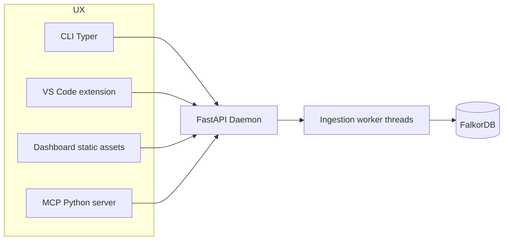

# CodeGraph — desktop process model & integration map

## Summary

CodeGraph runs as a **trusted-local daemon**:

1. **`codegraph serve`** — FastAPI + optional static dashboard + background ingestion worker loops.
2. **FalkorDB** container — persists all graph workspaces as **named graphs**.
3. **`codegraph` CLI / MCP shim / VS Code extension** — thin HTTP/WebSocket consumers.

FalkorDB uses Redis protocol; callers do not manage a separate user directory or Postgres layer for graphs.

---

## Component diagram

**LSP watcher** (`services/ingestion-worker/src/watcher/`) monitors the file system and emits `update` (delta manifest) requests to the async update queue. It cannot issue `check_update` or `recreate` — those are reserved for CLI, MCP, and REST callers. See [UPDATE_DESIGN.md](UPDATE_DESIGN.md) for the full surface permission table.

---

## Data lifetime & paths

| Artifact | Typical location | Notes |
|----------|-----------------|-------|
| Local config/state | `%USERPROFILE%\.codegraph` or `$HOME/.codegraph` | Graph registry snapshots, ingestion logs |
| Falkor persistence | Docker volume/host bind | Holds entire graph corpus |
| Source files | User-provided `local_path` | Never uploaded to cloud |

---

## Surface ↔ route mapping

| Surface | Invocation | Backend |
|---------|-------------|---------|
| CLI `graphs create` | `POST /api/v1/graphs` | FastAPI |
| CLI `graphs list` | `GET /api/v1/graphs` | FastAPI |
| CLI `repos add` | `POST /graphs/{}/repositories` | FastAPI |
| CLI `ingest run` | `POST /graphs/{}/repositories/{}/ingest` (SSE optional) | FastAPI |
| CLI `doctor` | `GET /health` + future diagnostics | FastAPI |
| MCP `graph.create` *(example tool name)* | same HTTP | FastAPI translation layer |
| VS Code palette actions | HTTPS `127.0.0.1:8765` | Extension HTTP client |

MCP transports only JSON payloads + optional streaming logs; MCP never opens Falkor sockets directly — keeps parity with CLI.

---

## Editor stories

### VS Code

- Ships as extension under `apps/vscode-extension`.
- Uses workspace settings for default graph/repo selection (`codegraph.workspaceGraph`).
- Leverages VS Code terminals to surface ingestion logs optionally.

### Other editors via MCP

- **Cursor**, **Claude Desktop**, JetBrains MCP, Zed MCP, Neovim + `mcp.nvim`, etc.—configure stdio MCP entrypoint referencing `apps/mcp-server`.

---

## Daemon responsibilities

| Module | Responsibility |
|--------|----------------|
| routers/graphs.py | Falkor lifecycle + bookkeeping |
| routers/repositories.py | Repo registry + ingestion triggers |
| workers/scheduler.py *(future)* | Queue Phase jobs; degrade to asyncio tasks early on |
| workers/update_queue.py *(future)* | Per-repo async update queue with combining rules; semaphore + snapshot on dequeue (see [UPDATE_DESIGN.md](UPDATE_DESIGN.md)) |
| watcher hookups | Emit `update` delta requests to the update queue |

---

## Security posture

Assume **trusted operator machine**. Daemon binds localhost; no auth tokens. Exposure beyond loopback requires explicit tunneling—which is discouraged without adding auth backlog.

---

## Related docs

- Main overview: [`README.md`](README.md)
- REST contract: [`Backend_API.md`](Backend_API.md)
- Update queue & locking design: [`UPDATE_DESIGN.md`](UPDATE_DESIGN.md)
- Repo layout: [`repository_structure.md`](repository_structure.md)
- Falkor operations: [`falkor/README.md`](falkor/README.md)
